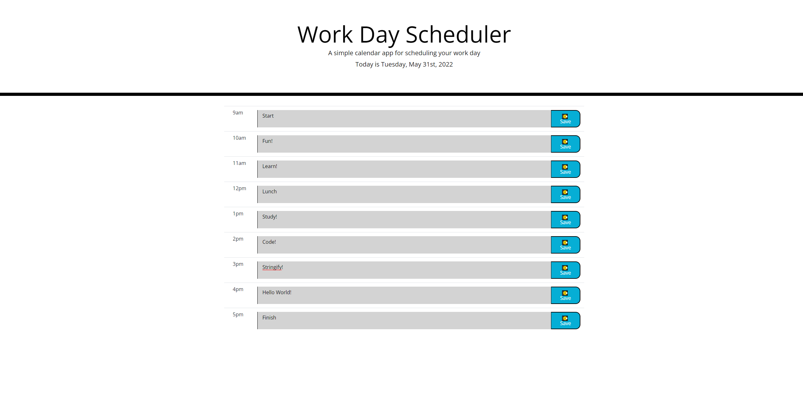

# Work Day Scheduler

## Table of Contents

- [Description](#description)
- [Visuals](#visuals)
- [Resources](#resources)

## Description

Setup a scheduler that accepts input in hourly blocks, and saves the input to localStorage for viewing on subsequent refreshes. Displays the current day and date at the top, and color codes the hourly blocks depending on their relation to the current time.

## Visuals

## Resources

[Live Site](https://bureizu742.github.io/work-day-scheduler/)

[Repository](https://github.com/Bureizu742/work-day-scheduler)